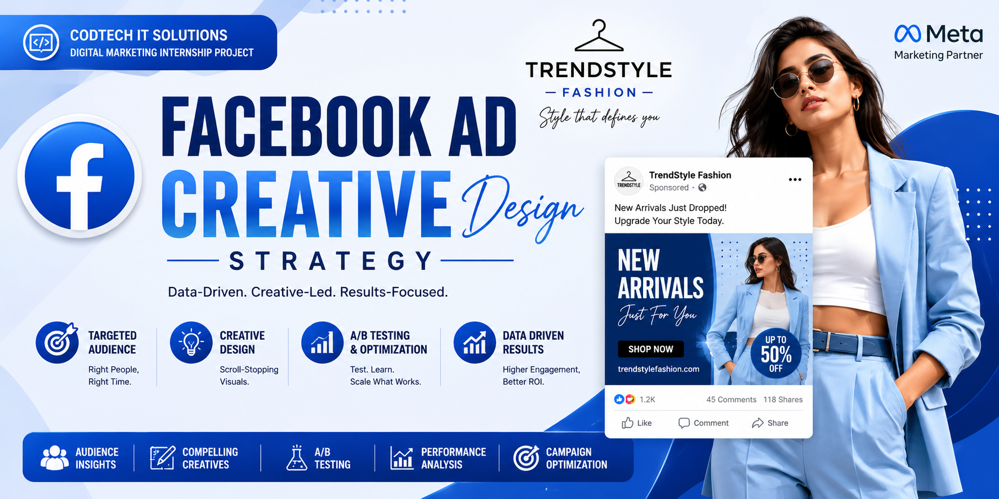

# Facebook Ad Creative Design Strategy - TrendStyle Fashion

## 📋 Internship & Candidate Profile
- **Intern Name:** Yeturi Nithya Niranjani
- **Intern ID:** CITS1133
- **Internship Domain:** Digital Marketing
- **Organization:** CODTECH IT Solutions
- **Project Reference:** Task 2 - Facebook Ad Creative Design
- **Brand Name:** TrendStyle Fashion
- **Date:** June 2026

---

## 🎯 Executive Summary
This project outlines a comprehensive Facebook advertising strategy tailored for TrendStyle Fashion. The core objective is to leverage Meta's advertising ecosystem to enhance brand visibility, foster community engagement, and drive quantifiable e-commerce conversions.

---

## 👥 Target Audience Analysis
To achieve a high Return on Ad Spend (ROAS), we have segmented the audience based on:
- **Demographics:** Age range 18-35, focusing on tech-savvy individuals.
- **Geographic Focus:** PAN India, specifically Tier-1 and Tier-2 urban hubs.
- **Psychographic Profile:** Individuals who prioritize "Aesthetic Appeal," follow global fashion influencers, and prefer convenience-based online shopping.
- **Behavioral Targeting:** Users who frequently interact with fashion retail pages, watch styling tutorials, and have a high affinity for mobile-first content.

---

## 🎨 Creative Ad Strategy & Execution

### 1. The Ad Hierarchy
* **Headline:** "Flat 40% OFF on New Fashion Collection"
* **Primary Text:** "Upgrade your wardrobe with TrendStyle Fashion. Discover trendy styles, premium quality, and exciting discounts. Shop now and enjoy Flat 40% OFF on selected collections. Limited Time Offer!"
* **Call to Action (CTA):** "Shop Now"

### 2. Strategic Visual Framework
* **Attention:** High-resolution lifestyle imagery that resonates with Gen-Z.
* **Interest:** Bullet points highlighting the "Uniqueness" of the fabric and the "Versatility" of the designs.
* **Desire:** Social proof and limited-time offer badges.
* **Action:** A frictionless path to purchase.

---

## 🛠 Advanced Ad Creative Testing (A/B Testing)
To maximize ROI, we implement A/B testing:
* **Visual Testing:** Comparing 'Static Images' vs 'Short-form Reels' to see which drives higher clicks.
* **Copy Testing:** Experimenting with 'Urgency-based' headlines vs 'Feature-based' headlines.
* **Audience Testing:** Testing broad interest-based audiences against 'Lookalike Audiences'.

---

## 💰 Budget Allocation & Scaling
We adopt a structured budget distribution to optimize performance:
- **Prospecting (70%):** Targeting new users to expand brand awareness.
- **Retargeting (30%):** Re-engaging users who visited the website but did not complete the purchase (using abandoned cart dynamic ads).

---

## 📈 Key Performance Indicators (KPIs)
- **CTR (Click-Through Rate):** Targeting > 2.0% for high-performing creatives.
- **CPC (Cost Per Click):** Keeping costs minimal through high-quality score.
- **Conversion Rate (CR):** Goal of 3-5% on landing pages.
- **CAC (Customer Acquisition Cost):** Maintaining healthy unit economics.

---

## 🚀 Risk Management & Contingency Plan
* **Low CTR:** If ads underperform, we immediately swap visuals (Creative Refresh) and refine audience targeting.
* **Ad Fatigue:** We rotate creative assets every 7 days to keep the audience engaged.
* **Budget Spikes:** Real-time monitoring of CPC to pause ads if costs exceed defined thresholds.

---

## 📝 Conclusion

This Facebook advertising campaign is not just about sales; it is about building an identity for TrendStyle Fashion. By aligning our creative vision with precise audience insights and rigorous testing, we are positioning the brand for long-term growth and market competitiveness.

---
⭐ Developed by **Yeturi Nithya Niranjani** as part of the **CODTECH IT Solutions Digital Marketing Internship Program (2026)**.

